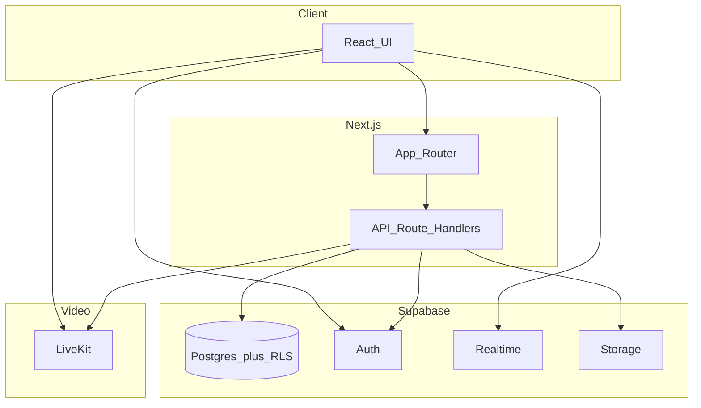

# Marriage View (marriage-app)

**Marriage View — The Video Dating Platform** is a marriage-oriented web app for thoughtful profile discovery, questionnaire-based compatibility, mutual matching, light coordination chat, and **video dates** (Video Date Room). It is built as a **Next.js** full-stack app backed by **Supabase** (Postgres, Auth, Realtime, Storage) and **LiveKit** (WebRTC).

> This project is suitable as a **prototype or MVP**. Hardening for public production (secrets hygiene, moderation scale, legal pages, observability) is left to your deployment standards.

**Positioning.** Today Marriage View is a coherent **matching infrastructure**: onboarding, filters, scoring, mutual matches, chat, and video. What turns it into a *product* users stay with is the layer above that: **explainable match quality**, **feed ranking that feels alive**, **retention loops** (reasons to return), **trust and moderation depth**, and optional **monetization** and **AI-assisted guidance**. The roadmap below is the intended upgrade path; most items are not implemented yet.

## Features

### Authentication and routing

- **Email + password** sign-in and sign-up via Supabase Auth.
- **Auth callback** at `/auth/callback` for email confirmation flows (when enabled in Supabase).
- **Home (`/`)** sends users to `/login` if unauthenticated, into **onboarding** if `onboarding_complete` is false, otherwise to **`/discover`**.

### Onboarding

- **Profile** (`/onboarding/profile`): core profile fields (display name, demographics, preferences, bio, location, etc.).
- **Photos** (`/onboarding/photos`): profile images (stored as URLs in the profile; uses your Supabase Storage setup as configured).
- **Questionnaire** (`/onboarding/quiz`): versioned **questions** with typed answers (single choice, multi, Likert, text, number). Wizard-style UI with progress and **save & continue** per step. The default bank is **version 1** (initial seed plus [`005_expand_questionnaire_v1.sql`](supabase/migrations/005_expand_questionnaire_v1.sql) for deeper marriage topics). Adding rows for the same version requires existing users to answer **new required** items before “finish” validates again.
- **Finish onboarding**: server/API flow marks the profile complete so the user can appear in Discover.

### Discover

- **Discover** (`/discover`): card stack of other **onboarded** users who pass filters (gender/seeking, age range, distance when coordinates exist, blocks, prior like/pass).
- **Compatibility** — Weighted, **explainable** questionnaire scoring (category multipliers, dealbreaker overrides). Each card shows a **match %**, **“Why this match?”** reasons, and a per-topic breakdown. Feed **ranking** blends compatibility with **profile completeness**, **recency** (`last_active_at`), **message activity** (last 30 days), a **bounded** boost from the other person’s **reflection/journal signals** (`user_ranking_prefs`, updated by [`/api/cron/personalize-ranking`](app/api/cron/personalize-ranking/route.ts)), and **diversity** within score tiers. Optional tuning: `GET /api/discover?debug=1` returns ranking metadata (requires auth).
- **Pass** and **Like** actions; **mutual likes** create a **match**.
- **Diagnostics** when the feed is empty (counts explaining server-side filtering) to simplify testing and support.

### Matches and chat

- **Matches** (`/matches`): inbox-style list with avatar, last message preview, relative time, and **unread** indication (coordinated with client read state). Optional **Liked you** teaser when [`see_who_liked_you`](#feature-flags-and-likes) is enabled.
- **Likes** (`/likes`): people who liked you before a mutual match; gated by feature flag. **Plus** (or default tier—see [Entitlements](#entitlements-default-plus)) sees the full list; others see count + silhouette preview. Data: [`GET /api/inbound-likes`](app/api/inbound-likes/route.ts).
- **Chat** (`/chat/[matchId]`): message thread with **Supabase Realtime** (`postgres_changes` on `messages`), grouped day labels, bubbles, and composer (Enter to send, Shift+Enter for newline). **New / empty threads** show a short in-thread tip: say hello, introduce yourself, and when it feels natural suggest a time for a video date (early messages stay light; deeper topics on the call). **Daily icebreakers** (collapsible strip above the composer) save to `profiles.icebreaker_answers` via [`/api/daily-prompt`](app/api/daily-prompt/route.ts). After a **video date**, a guided **private reflection** modal offers a short journal entry and an optional **end match** control ([`DELETE /api/matches/[matchId]`](app/api/matches/[matchId]/route.ts)); your saved reflections stay on your account with `match_id` cleared ([`015_match_journal_unmatch.sql`](supabase/migrations/015_match_journal_unmatch.sql)).
- **Typing** and **read cursor** per match: Realtime on `match_typing` and `match_read_state` (see [`004_premium_layer.sql`](supabase/migrations/004_premium_layer.sql)). Outgoing bubbles show **Sent** / **Read** from the other participant’s `last_read_message_id` (timestamp-based so pagination does not break receipts).
- **Block** from chat: stops discovery interaction and redirects appropriately.
- **Video call** (LiveKit): in-room WebRTC; token minted by the app API; inserts a **`call_signals`** row for the callee (Realtime ring + toast). Callee can dismiss via **`POST /api/call-signal/dismiss`**. Pending signals are also surfaced in the **nav notifications** dropdown (see below). The client uses a **longer automatic reconnect** backoff for brief signal drops; if the SDK still disconnects, a **grace banner** offers **Reconnect now** (fresh token, same room instance) or **Leave**—intentional **End** does not trigger that banner.

### Notifications

- **Activity bell** (nav): loads **`GET /api/notifications`**, which merges **`user_notifications`** with outstanding **`call_signals`** where you are the **callee**. Rows use synthetic ids `call:<uuid>`. Invites older than ~90s are labeled **Missed video date** (amber styling); newer rows show as **Video call**. Opening an item PATCHes read state (normal notifications) or **deletes the call signal** (same as clearing the invite). **Mark all read** clears unread notifications and **all** pending call signals for you. Realtime subscriptions keep the list updated.
- **Email digest** (optional): scheduled **`GET /api/cron/email-digest`** (Bearer `CRON_SECRET`) batches unread in-app notifications into a Resend email when configured.

### Settings and safety

- **Settings** (`/settings`): **appearance** (system / light / dark theme, persisted locally), **retention nudges** (toggles for journal prompts / re-engagement / weekly hints via [`/api/me/notification-prefs`](app/api/me/notification-prefs/route.ts)), **reflections progress** summary, copyable **user id**, **current tier** (see [Entitlements](#entitlements-default-plus)), **submit report** (MVP: target user UUID), **blocked users** list with unblock, **sign out**, link to admin (if permitted).

### Admin (restricted)

- **Who can access:** In **production** (`NODE_ENV=production`), only signed-in users listed in **`ADMIN_USER_IDS`** (comma-separated UUIDs, checked first) or **`ADMIN_EMAILS`** (comma-separated emails) can use **`/admin`** and **`/api/admin/*`**. If neither list is configured, admin routes return **503** (misconfiguration). **`ADMIN_RELAXED_AUTH` is ignored in production** (it cannot open admin to every signed-in user). In **`next dev`** (`NODE_ENV=development`), any signed-in user may use admin; a **banner** explains this.
- **Before a public launch:** Set **`ADMIN_EMAILS`** and/or **`ADMIN_USER_IDS`** on the server; deploy with **`NODE_ENV=production`**; confirm you do **not** rely on relaxed dev-only access; run migrations through **`013_admin_audit_log.sql`** if you want mutation audit rows in **`admin_audit_log`**.
- **Dashboard** (`/admin`): broad **telemetry** — core counters, demographics (age, gender, seeking, cross-tabs), preferences, geography, growth tables, derived ratios, **journal entry totals**, **urgent pending reports** (fast-track post-call), plus links into sub-areas.
- **Users** (`/admin/users`): search, pagination, **onboarding** filter (complete / incomplete / all). **User detail** (`/admin/users/[id]`): profile, entitlements, **retention** (last active, notification nudge toggles, discover ranking prefs), matches, **private match journal** (read-only for moderation/support), **questionnaire** view/edit (version-aligned), **chat history** per match, **activity** (interactions, blocks, reports with **urgent** / **match** context when present).
- **Questions** (`/admin/questions`), **Reports** (`/admin/reports`), **Matches**, **Feature flags** (`/admin/flags`): CRUD / triage via admin API routes (service role + `requireAdmin`).

### Entitlements (default Plus)

- **`getUserTier`** ([`lib/entitlements.ts`](lib/entitlements.ts)): users **without** a [`user_entitlements`](supabase/migrations/004_premium_layer.sql) row are treated as **Plus** (discover limits, inbound likes unlock, filters, etc.). Admins set **Free** by saving an explicit **`tier: 'free'`** row (API upsert, not delete). Expired **Plus** rows still resolve to Free until renewed.
- Admin dashboard telemetry: **Profiles on Plus tier** is approximated as registered profiles minus **explicit Free** rows.

### Feature flags and Likes

- Public read: [`GET /api/feature-flags`](app/api/feature-flags/route.ts) (cached in the client provider). Key **`see_who_liked_you`** must be enabled in `feature_flags` for the Likes wall and matches teaser. Migration [`012_see_who_liked_you_enabled.sql`](supabase/migrations/012_see_who_liked_you_enabled.sql) turns it on by default (admins can disable in `/admin/flags`).

### UX and UI

- Design tokens (CSS variables), **Fraunces** display font, mesh-style page background, **card** surfaces, global **toasts**, shared **empty states**, sticky app nav with match **unread badge** and **notifications** bell, safe-area padding for mobile.

## Roadmap (vision beyond MVP)

Ordered roughly by leverage for trust, retention, and perceived liquidity:

1. **Compatibility engine 2.0** — **Largely shipped:** weighted categories, normalization, dealbreakers, and explainable payloads in [`lib/matching/score.ts`](lib/matching/score.ts) / [`GET /api/discover`](app/api/discover/route.ts). **Discover score snapshots:** [`017_discover_compatibility_cache.sql`](supabase/migrations/017_discover_compatibility_cache.sql) caches directional `(viewer, candidate)` explain results; invalidated when either user’s **answers** or **questionnaire_version** changes (or the question-bank hash changes). **`?debug=1`** includes `discoverCompatibilityCache` hit/miss counts. Further work: richer category model, score snapshots beyond Discover if needed.
2. **Discover ranking** — **Largely shipped (MVP+):** recency, **profile completeness**, **engagement** (messages last 30 days), **diversity** within score tiers, empty-feed **diagnostics**, and **`?debug=1`** ranking metadata on [`GET /api/discover`](app/api/discover/route.ts). Further tuning and explicit small-pool **fallback** rules remain as polish.
3. **Retention loops** — **Partial:** in-app **`user_notifications`**, optional **weekly email digest** of unread notifications ([`/api/cron/email-digest`](app/api/cron/email-digest/route.ts)), nav bell surfacing **video call / missed call** via **`call_signals`**. **Not yet:** daily “top compatibility picks” job, dedicated **`user_engagement_events`** table, structured re-engagement rules for inactive users.
4. **Trust and safety** — Photo **verification** flag (manual workflow or AI-ready placeholder); richer **report** taxonomy; **soft-ban / shadow restrict** under review; stronger **rate limits** and **abuse pattern** detection; **admin moderation** workflows beyond MVP reports list (admin user detail + reports list help triage).
5. **Chat upgrades** — **Typing**, **read cursor**, and **Sent / Read** on your bubbles are **shipped** (Realtime + `match_read_state`). **Still open:** lightweight **reactions**, viewport-based read marking, scroll and subscription performance tuning.
6. **Things in common (match insights)** — **Shipped (MVP):** **In common** tab next to **Messages** in each match (`MatchCommonGround` + `GET /api/matches/[matchId]/common-answers`). Lists prompts from **`questions` + `answers`** where both people gave the **exact same** stored answer (single/Likert option, same multi set, same number, case-insensitive text). Uses the **viewer’s** `questionnaire_version` for ordering; if versions differ, a banner explains the list is based on your bank. **New DB questions for that version appear automatically** once both sides have answers.
7. **Monetization spine** — **Partial:** **`user_entitlements`** (default **Plus**; explicit **Free** row to limit an account), [**feature flags**](app/api/feature-flags/route.ts), discover **interaction caps** by tier, admin grant/revoke, **see who liked you** behind flag + tier. **Not yet:** Stripe (or other) checkout, self-serve billing portal, promo codes.
8. **AI-assisted layer (optional)** — Server-side abstraction for LLM calls: profile **summaries**, **bio suggestions**, **compatibility blurbs** for matched pairs, **low-effort profile** nudges. Keep prompts and PII handling on the server.
9. **Mobile** — This repo is a **web app**; Play Store / App Store need a **wrapper** (e.g. **Capacitor** WebView to your production URL, or **TWA** on Android) plus store listings, privacy/terms URLs, and native **camera/mic** strings for LiveKit. See [Deployment and mobile](#deployment-and-mobile) below.

**Implementation prompts.** Copy-paste Cursor briefs aligned with the roadmap (A–G), plus optional automation notes: [`docs/cursor-prompts.md`](docs/cursor-prompts.md).

## Architecture

High-level request and data flow:



- **Browser** loads the Next.js app; authenticated reads/writes use the Supabase client where RLS allows.
- **Sensitive orchestration** (discover scoring, interactions, messages validation, LiveKit tokens, admin) goes through **Route Handlers** using the server Supabase client and, where appropriate, the **service role** (never exposed to the client).

## Monetization strategy (product intent)

Not fully implemented; this is the intended **business spine** so features can be gated before a billing provider is wired:

- **Subscription tier** — Code defaults to **Plus** for all accounts unless an explicit **Free** row exists; tune limits in [`lib/entitlements.ts`](lib/entitlements.ts) and interact API when you introduce real billing.
- **See who liked you** — Shipped behind **`see_who_liked_you`** flag; Plus (or default tier) unlocks full list.
- **Profile boost** — Time-boxed visibility lift in discover ranking; cap frequency to avoid spammy feeds.
- **Advanced filters** — Extra dimensions (e.g. height, denomination, education) behind premium, once data and UX are ready.
- **Entitlements table + feature flags** — Single source of truth checked in API and mirrored in UI to avoid “leaky” premium features.

## Production hardening plan

Short checklist for moving from prototype to something you’d put real users on:

- **Secrets** — No real keys in repo or public examples; rotate any leaked keys; service role only on server.
- **Rate limiting** — Today there are DB-backed hourly caps for some actions; production usually adds **IP / user** limits (edge or Redis/Upstash) on discover, messages, reports, and token minting.
- **Observability** — Structured logging for API routes, error tracking (e.g. Sentry), uptime checks, dashboards for latency and 5xx rates.
- **Abuse and trust** — Document moderation SLA, escalation path, and roadmap for automated signals (velocity, reports, duplicate accounts).
- **Data** — RLS audit, backup/PITR policy, tested restore; legal pages (terms, privacy, age requirement) and data deletion/export if you operate in regulated regions.
- **Email and deliverability** — Custom SMTP for Supabase auth emails in production.

## Tech stack

| Layer | Choice |
| ------------ | ------------------------------------------- |
| Framework    | Next.js (App Router), React 19              |
| Styling      | Tailwind CSS v4                             |
| Database/Auth| Supabase (Postgres + RLS, Auth, Realtime)   |
| Video        | LiveKit (cloud or self-hosted)              |
| Language     | TypeScript                                  |

## Prerequisites

- **Node.js** 20+ (recommended; align with your deployment).
- A **Supabase** project with schema applied (see below).
- A **LiveKit** project (URL + API key + secret) if you use video calls.

## Environment variables

Copy `.env.local.example` to `.env.local` and fill in **your own** values. Never commit real secrets or paste production keys into a public README.

| Variable | Description |
| -------- | ----------- |
| `NEXT_PUBLIC_SUPABASE_URL` | Supabase project URL |
| `NEXT_PUBLIC_SUPABASE_ANON_KEY` | Supabase anon (public) key |
| `SUPABASE_SERVICE_ROLE_KEY` | Service role key (**server only**; used by API routes that must bypass RLS safely) |
| `LIVEKIT_URL` | WebSocket URL for LiveKit (e.g. `wss://...`) |
| `LIVEKIT_API_KEY` | LiveKit API key |
| `LIVEKIT_API_SECRET` | LiveKit API secret |
| `ADMIN_EMAILS` | Comma-separated emails allowed for admin UI/API (after `ADMIN_USER_IDS` check) |
| `ADMIN_USER_IDS` | Optional comma-separated auth user UUIDs allowed for admin (OAuth / break-glass) |
| `ADMIN_RELAXED_AUTH` | Ignored for access control in production; only **`NODE_ENV=development`** relaxes admin to any signed-in user |
| `CRON_SECRET` | Bearer token for `GET /api/cron/email-digest` (and any other cron routes you add) |
| `RESEND_API_KEY`, `RESEND_FROM` | Optional; enable digest emails and **urgent post-call** alerts to staff |
| `NEXT_PUBLIC_SUPPORT_EMAIL` | Optional; shown as **Email support** in the post-call reflection flow (`mailto:`) |
| `SUPPORT_ALERT_EMAIL` | Optional; receives an immediate email (via Resend) when someone uses **Send to care team** after a video date |
| `NEXT_PUBLIC_SITE_URL` | Site origin for absolute links in emails |

## Database and Supabase

- **Migrations**: [`supabase/migrations/001_initial.sql`](supabase/migrations/001_initial.sql) — tables for profiles, versioned questions, private answers, interactions, blocks, reports, matches, messages, plus RLS policies, triggers, and storage-related setup as defined in that file.
- [`013_admin_audit_log.sql`](supabase/migrations/013_admin_audit_log.sql) — **`admin_audit_log`** for server-side records of admin mutations (entitlements, feature flags, reports triage, questionnaire edits).
- **Follow-up**: [`supabase/migrations/002_discover_ranking.sql`](supabase/migrations/002_discover_ranking.sql) — `profiles.last_active_at` and `message_counts_last_days()` RPC for discover ranking (apply after `001` in the same project).
- [`003_call_signals.sql`](supabase/migrations/003_call_signals.sql) — incoming video call signals (Realtime); used by LiveKit token route and notification merge.
- [`004_premium_layer.sql`](supabase/migrations/004_premium_layer.sql) — `match_typing`, `match_read_state`, `user_notifications`, push subs, `user_entitlements`, feature flags, `photo_guidelines_acknowledged`, notification triggers, etc.
- [`006_realtime_replica_identity.sql`](supabase/migrations/006_realtime_replica_identity.sql) — **FULL** replica identity on `match_read_state` (and related) so Realtime updates include `last_read_message_id` for read receipts.
- [`014_retention_journal_ranking.sql`](supabase/migrations/014_retention_journal_ranking.sql) — private **`match_journal_entries`**, **`profiles.notification_prefs`**, **`user_notifications.metadata`**, **`user_ranking_prefs`** (Discover boost from journal aggregates; cron [`personalize-ranking`](app/api/cron/personalize-ranking/route.ts)).
- [`015_match_journal_unmatch.sql`](supabase/migrations/015_match_journal_unmatch.sql) — **`matches_delete_participant`** RLS; journal **`match_id`** nullable with **`ON DELETE SET NULL`** so reflections survive unmatch.
- [`016_journal_focus_moderation.sql`](supabase/migrations/016_journal_focus_moderation.sql) — journal **`focus_areas`** + purposeful-reflection signal; **`reports.priority`** / **`reports.match_id`** for **urgent** post-call escalations ([`/api/support/post-call-concern`](app/api/support/post-call-concern/route.ts)).
- [`017_discover_compatibility_cache.sql`](supabase/migrations/017_discover_compatibility_cache.sql) — **`discover_compatibility_cache`** for [`GET /api/discover`](app/api/discover/route.ts); triggers clear rows when **`answers`** or **`profiles.questionnaire_version`** changes.
- Later migrations (questionnaire, verification, **daily prompt slots**, **`profiles.icebreaker_answers`**, **`see_who_liked_you` default on**) — apply in numeric order; see `supabase/migrations/`.
- **Verification**: [`supabase/verify_schema.sql`](supabase/verify_schema.sql) — run in the SQL editor; includes checks that **`messages`** and **`match_read_state`** are in the **`supabase_realtime`** publication.

Apply migrations in a **fresh** project or patch incrementally if objects already exist (comments in the migration warn about re-running blindly).

## Scripts

```bash
npm install
npm run dev      # development server (default http://localhost:3000)
npm run build    # production build
npm run start    # production server (after build)
npm run lint     # ESLint
npm run export:review  # writes code-review-bundle.txt (single file for external AI review; can be large)
```

## Deployment and mobile

- **Hosting:** Deploy the Next.js app to **Vercel** (or any Node host). Set **environment variables** from [Environment variables](#environment-variables) in the project dashboard; set **`NEXT_PUBLIC_SITE_URL`** to your production origin. If the repo root is not the app folder, set **Root Directory** to `marriage-app` (or your subfolder name).
- **Supabase:** Point Auth **Site URL** and **Redirect URLs** at your production domain; run all migrations against the linked project.
- **Cron:** [`vercel.json`](vercel.json) defines schedules for digest / weekly jobs; on Vercel, set **`CRON_SECRET`** and use a plan that supports scheduled functions.
- **Play Store / App Store:** There is no native binary in this repo. Use a **Capacitor** (or similar) shell loading your HTTPS URL, or **TWA** for Android; configure **camera/microphone** permissions for the **Video Date Room** (LiveKit). Use your live **`/privacy`** and **`/terms`** URLs in store listings.

## HTTP API (App Router)

Server routes under `app/api/` (all relative to the site origin):

| Route | Purpose |
| ----- | ------- |
| `GET /api/discover` | Discover feed: profiles, normalized `score`, **`insight`** (reasons + category breakdown), optional `diag`; add `?debug=1` for ranking tuning fields |
| `GET /api/profiles/[userId]/viewer` | Curated profile for another member (auth; blocks + `onboarding_complete` required). Optional `?matchId=` ties access to an existing match (chat). Omits coordinates and internal verification paths |
| `POST /api/interact` | Like or pass another user |
| `GET /api/inbound-likes` | Inbound likes (not yet matched); flag + tier gated |
| `GET /api/feature-flags` | Public feature flag map for client |
| `GET/POST /api/daily-prompt` | Daily icebreaker prompts + save answers to profile |
| `POST /api/messages` | Send a chat message in a match |
| `POST /api/block` | Block a user |
| `DELETE /api/block` | Unblock (`blockedId` query) |
| `POST /api/report` | Submit a safety report |
| `POST /api/livekit/token` | Mint a LiveKit room token for a match |
| `POST /api/onboarding/complete` | Mark onboarding finished (server-validated) |
| `GET /api/matches/summary` | Threads + last message for nav unread counts |
| `GET/PATCH /api/notifications` | In-app notifications + merged pending **`call_signals`** (synthetic `call:` ids); mark read / dismiss call |
| `POST /api/call-signal/dismiss` | Callee clears **`call_signals`** for a match |
| `GET /api/cron/email-digest` | Weekly-style digest email (Bearer `CRON_SECRET`; optional Resend) |
| `GET/POST/PATCH .../api/admin/*` | Admin-only stats, profiles, questionnaire, messages preview, activity, questions, reports, flags, entitlements |

Exact methods and bodies are defined in each `route.ts` file.

## Project layout (high level)

```
app/ # App Router pages and layouts
  api/                # Route handlers
  admin/              # Admin UI
  auth/               # OAuth/email callback
  chat/[matchId]/     # Chat room
  discover/           # Discover UI
  login/              # Auth UI
  likes/              # Who liked you (flag + tier)
  matches/            # Matches list
  onboarding/         # Profile, photos, quiz
  settings/           # Settings and safety
components/           # React components (nav, chat, video, quiz, etc.)
lib/                  # Supabase clients, matching, rate limits, theme, types
supabase/             # SQL migrations and verify script
```

## Security notes (short)

- Keep **`SUPABASE_SERVICE_ROLE_KEY`** only on the server.
- Prefer **RLS** for all user data; use the service role only in trusted API code paths.
- Replace any **example** env files that contain real keys before publishing the repo; rotate leaked keys in Supabase and LiveKit.

## License

Private / unlicensed unless you add a `LICENSE` file. All rights reserved by the repository owner unless stated otherwise.
